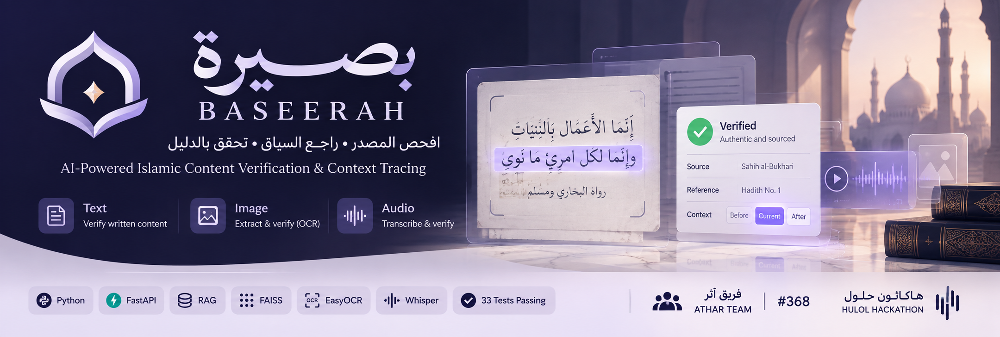

<p align="center">
  
</p>

<h1 align="center">بصيرة | BASEERAH</h1>

<p align="center">
  <strong>منصة ذكاء اصطناعي للتحقق من المحتوى الإسلامي الرقمي وتتبع مصدره وسياقه الأصلي</strong>
</p>

<p align="center">
  AI-Powered Islamic Content Verification & Context Tracing
</p>

<p align="center">
  <strong>فريق أثَر | ATHAR — #368</strong><br>
  Islamic AI Challenge Hackathon
</p>

---

## عن بصيرة

**بصيرة (BASEERAH)** نموذج أولي يستخدم تقنيات الذكاء الاصطناعي للمساعدة في التحقق من المحتوى الإسلامي الرقمي المتداول، والعودة إلى المصدر والسياق بدل الاكتفاء باقتباس أو مقطع منفصل.

الفكرة الأساسية ليست توليد إجابة دينية جديدة، بل:

**المحتوى → استخراج النص → البحث في مصادر محددة → قياس قوة الدليل → إظهار المصدر والسياق أو الامتناع عند عدم كفاية الدليل.**

يدعم النموذج الحالي:

- **Text Verification** — التحقق من النصوص والاقتباسات.
- **Image Verification** — استخراج النص العربي من الصور ثم التحقق منه.
- **Audio Verification** — تحويل الصوت إلى نص ثم البحث عن المصدر والسياق.
- **Speaker Comparison** — مقارنة تمثيلات صوتية بين تسجيل مرجعي وتسجيل مرشح.
- **Context Trace** — إظهار السياق المحيط بالمحتوى المسترجع.
- **Safe Abstention** — عدم الادعاء بوجود دليل عندما لا تكون الأدلة كافية.
- **Experimental Audio Authenticity Analysis** — مؤشرات تجريبية مساعدة لتحليل بعض خصائص التسجيلات الصوتية.

> **مهم:** بصيرة أداة مساعدة للوصول إلى الأدلة والمصادر والسياق، وليست أداة لإصدار الفتاوى، كما أن مؤشرات تحليل الصوت لا تمثل إثباتًا جنائيًا نهائيًا لهوية المتحدث أو أصالة التسجيل.

---

# Quick Start

## 1. المتطلبات

المشروع يستخدم:

```text
Python 3.13
Git
FFmpeg
```

### تثبيت FFmpeg

على macOS باستخدام Homebrew:

```bash
brew install ffmpeg
```

على Ubuntu / Debian:

```bash
sudo apt update
sudo apt install ffmpeg
```

للتحقق:

```bash
python3 --version
ffmpeg -version
```

> بعض نماذج الذكاء الاصطناعي يتم تحميلها عند أول استخدام، لذلك قد يكون أول طلب أبطأ من الطلبات التالية ويحتاج اتصالًا بالإنترنت لتنزيل النموذج إذا لم يكن موجودًا محليًا.

---

## 2. تحميل المشروع

```bash
git clone https://github.com/Danakaabi/baseerah.git
cd baseerah
```

---

## 3. إنشاء Virtual Environment

### macOS / Linux

```bash
python3 -m venv .venv
source .venv/bin/activate
```

### Windows PowerShell

```powershell
python -m venv .venv
.venv\Scripts\Activate.ps1
```

---

## 4. تثبيت المكتبات

```bash
python -m pip install --upgrade pip
pip install -r requirements.txt
```

---

## 5. تشغيل المشروع

```bash
uvicorn app.main:app --host 127.0.0.1 --port 8000
```

ثم افتح:

```text
http://127.0.0.1:8000/
```

سيتم تحويلك تلقائيًا إلى واجهة بصيرة:

```text
http://127.0.0.1:8000/ui/
```

واجهة توثيق الـAPI:

```text
http://127.0.0.1:8000/docs
```

---

# Health Check

```bash
curl http://127.0.0.1:8000/health
```

النتيجة المتوقعة:

```json
{
  "status": "ok",
  "service": "BASEERAH API",
  "version": "0.1.0"
}
```

---

# Demo Samples

العينات التالية موجودة داخل المستودع، وتم اختبار المسارات التالية محليًا قبل التسليم.

---

## 1. Text Verification

مثال نص:

```text
إن الله لا ينظر إلى صوركم وأموالكم
```

تشغيل:

```bash
curl -X POST http://127.0.0.1:8000/verify/text \
  -H "Content-Type: application/json" \
  -d '{"text":"إن الله لا ينظر إلى صوركم وأموالكم"}'
```

في الاختبار المرجعي أعاد النظام:

```text
status: evidence_found
source: HadeethEnc
final_score: 1.0
```

ويعيد كذلك بيانات المصدر والنص المرتبط والسياق المتاح.

---

## 2. Image Verification

صورة الاختبار:

```text
data/demo/hadeethenc/hadith_test.jpg
```

تشغيل:

```bash
curl --max-time 180 -X POST \
  http://127.0.0.1:8000/verify/image \
  -F "image=@data/demo/hadeethenc/hadith_test.jpg"
```

في الاختبار المرجعي:

```text
status: evidence_found
source: HadeethEnc
final_score ≈ 0.7501
```

المسار:

```text
Image
  ↓
EasyOCR
  ↓
Arabic Text Blocks
  ↓
Candidate Windows
  ↓
Retrieval / Verification
  ↓
Source + Context
```

قد ينتج OCR نصًا يحتوي على أخطاء بسيطة بسبب جودة الصورة أو شكل الخط، لذلك لا يعتمد بصيرة على التطابق الحرفي فقط في مسار الاسترجاع.

---

## 3. Audio Verification

ملف الاختبار:

```text
data/demo/audio/islamhouse_hadith_test_60s.wav
```

تشغيل:

```bash
curl --max-time 300 -X POST \
  http://127.0.0.1:8000/verify/audio \
  -F "audio=@data/demo/audio/islamhouse_hadith_test_60s.wav;type=audio/wav"
```

في الاختبار المرجعي:

```text
status: evidence_found
source: الدرر السنية - الموسوعة الحديثية
document: أي الأعمال أفضل؟
final_score ≈ 0.7654
```

المسار:

```text
Audio
  ↓
Faster-Whisper
  ↓
Arabic Transcript
  ↓
Text Windows
  ↓
Retrieval / Quote Matching
  ↓
Trusted Source
  ↓
Context Trace
```

حتى مع وجود اختلافات بسيطة في التفريغ الصوتي، استطاع النظام استرجاع المصدر المرتبط بالمحتوى في عينة الاختبار.

---

# Speaker Comparison Demo

يحتوي المشروع على مسار لمقارنة تسجيل صوتي مرجعي مع تسجيل مرشح باستخدام نموذج Speaker Verification.

النموذج المستخدم:

```text
microsoft/wavlm-base-plus-sv
```

المقياس:

```text
Cosine Similarity
```

## مثال 1: تسجيلان من مجموعة المتحدث نفسه

```bash
curl --max-time 300 -X POST \
  http://127.0.0.1:8000/verify/speaker \
  -F "reference_audio=@data/speaker_calibration/binbaz/test_01.wav;type=audio/wav" \
  -F "candidate_audio=@data/speaker_calibration/binbaz/test_02.wav;type=audio/wav"
```

النتيجة التي تم رصدها في اختبار الـMVP:

```json
{
  "reference_available": true,
  "speaker_similarity": 0.9418506622314453,
  "speaker_interpretation": "uncertain",
  "metric": "cosine_similarity",
  "model": "microsoft/wavlm-base-plus-sv",
  "analysis_seconds": 20,
  "decision_threshold": 0.95,
  "identity_confirmed": false,
  "calibration_status": "mvp_thresholds_not_final"
}
```

---

## مثال 2: تسجيلان من مجموعتي متحدثين مختلفتين

```bash
curl --max-time 300 -X POST \
  http://127.0.0.1:8000/verify/speaker \
  -F "reference_audio=@data/speaker_calibration/binbaz/test_01.wav;type=audio/wav" \
  -F "candidate_audio=@data/speaker_calibration/binothaimeen/test_01.wav;type=audio/wav"
```

النتيجة التي تم رصدها:

```json
{
  "reference_available": true,
  "speaker_similarity": 0.7990338206291199,
  "speaker_interpretation": "low_similarity",
  "metric": "cosine_similarity",
  "model": "microsoft/wavlm-base-plus-sv",
  "analysis_seconds": 20,
  "decision_threshold": 0.95,
  "identity_confirmed": false,
  "calibration_status": "mvp_thresholds_not_final"
}
```

### ملاحظة مهمة حول Speaker Verification

قيمة:

```text
speaker_similarity
```

هي **Cosine Similarity** بين تمثيلات صوتية وليست Probability لهوية الشخص.

حد القرار الحالي:

```text
0.95
```

هو حد محافظ مستخدم في نموذج الـMVP، وليس Threshold نهائيًا تمت معايرته على Dataset إنتاجية أو جنائية.

ولهذا يعيد النظام أيضًا:

```text
identity_confirmed: false
calibration_status: mvp_thresholds_not_final
```

بدل الادعاء بأن هوية الشخص تم إثباتها بشكل قطعي.

---

# كيف يعمل بصيرة؟

```text
                         USER INPUT
                             │
          ┌──────────────────┼──────────────────┐
          │                  │                  │
        Text               Image              Audio
          │                  │                  │
          │               EasyOCR        Faster-Whisper
          │                  │                  │
          └──────────────────┼──────────────────┘
                             │
                    Arabic Text Processing
                             │
                    Candidate Generation
                             │
                 Retrieval / Quote Matching
                             │
                Trusted Knowledge Base
                             │
              Sentence Embeddings + FAISS
                             │
                      Confidence Gate
                     ┌───────┴───────┐
                     │               │
               Evidence Found    Weak / No Evidence
                     │               │
                Context Trace     Safe Abstention
                     │               │
                     └───────┬───────┘
                             │
                             ▼
                   Verification Result
```

---

# Core AI Pipeline

## Text Processing

النص العربي يمر بمرحلة معالجة قبل البحث، مع الاحتفاظ بالنص الأصلي للعرض.

الفكرة هي الفصل بين:

```text
original_text
```

و:

```text
normalized_text
```

بحيث يستخدم النص المعالج للمطابقة والاسترجاع، بينما يبقى النص الأصلي متاحًا للعرض والتوثيق.

---

## Embeddings

يستخدم المشروع:

```text
sentence-transformers/paraphrase-multilingual-MiniLM-L12-v2
```

لإنشاء Embeddings متعددة اللغات، ومنها العربية.

---

## Vector Search

يستخدم:

```text
FAISS
```

للبحث في الـVector Index واسترجاع المقاطع الأقرب إلى Query.

---

## Context Trace

لا يهدف النظام فقط إلى إظهار الجملة المطابقة، بل إلى ربطها بالسياق المتاح.

مثال:

```text
Previous Context
       ↓
Matched Content
       ↓
Next Context
```

وذلك للمساعدة في اكتشاف الحالات التي يكون فيها الاقتباس صحيحًا لفظيًا لكنه معروض خارج سياقه.

---

# Audio Intelligence

مسار الصوت في بصيرة يتضمن عدة مكونات مستقلة.

## Speech-to-Text

```text
Faster-Whisper
```

يستخدم لتحويل التسجيل الصوتي إلى نص يمكن إدخاله في مسار التحقق والاسترجاع.

---

## Speaker Comparison

```text
WavLM
```

يستخدم لاستخراج تمثيلات صوتية ومقارنة تسجيلين باستخدام Cosine Similarity.

---

## Synthetic Voice Detection

يتضمن المشروع مكونًا تجريبيًا لتحليل احتمالية وجود خصائص مرتبطة بالصوت الصناعي باستخدام نموذج ONNX.

هذه النتيجة تعتبر **إشارة مساعدة فقط** داخل الـMVP ولا تستخدم كإثبات قطعي.

---

## Tampering / Audio Authenticity

يتضمن المشروع أيضًا تحليلًا تجريبيًا لبعض خصائص الصوت التي قد تساعد في رصد مؤشرات غير طبيعية.

هذا الجزء ما زال ضمن نطاق:

```text
Experimental MVP Signal
```

ولا يمثل نظام Audio Forensics معتمدًا.

---

## Human Review

الحالات غير الحاسمة يمكن تصنيفها للمراجعة البشرية بدل إعطاء قرار قطعي.

هذه السياسة مهمة خصوصًا عندما تكون:

- الأدلة ضعيفة.
- درجة التشابه غير حاسمة.
- المصدر غير متوفر.
- نتائج تحليل الصوت متضاربة.
- الحالة تقع في منطقة رمادية.

---

# Unified Audio Verification

يتضمن المشروع مسارًا موحدًا لتحليل الصوت:

```http
POST /verify/audio/full
```

والهدف منه جمع أكثر من إشارة تحليلية ضمن استجابة واحدة بدل الاعتماد على مؤشر واحد فقط.

المبدأ:

```text
Audio
  │
  ├── Speech-to-Text
  │
  ├── Source Retrieval
  │
  ├── Context Trace
  │
  ├── Speaker Analysis
  │
  ├── Synthetic Voice Signal
  │
  └── Audio Authenticity Signals
          │
          ▼
      Review Policy
```

---

# Safe Abstention

من المبادئ الأساسية في بصيرة أن عدم العثور على دليل كافٍ لا يتحول تلقائيًا إلى حكم بأن المحتوى خاطئ.

بدل ذلك يمكن للنظام الامتناع عن الادعاء.

الفكرة:

```text
Strong Evidence
      ↓
Return Source + Context
```

أما:

```text
Insufficient Evidence
      ↓
Do Not Invent a Source
      ↓
Abstain / Request Review
```

وهذا يقلل من خطر Hallucination في سيناريو التحقق.

---

# Knowledge Base

قاعدة المعرفة في الـMVP محدودة ومقصودة لأغراض النموذج الأولي.

من البيانات والمصادر المستخدمة في الاختبارات:

- **HadeethEnc** — موسوعة الأحاديث النبوية.
- **الدرر السنية** — الموسوعة الحديثية.
- **IslamHouse** — مادة صوتية تجريبية.

لا يعتمد النظام على بحث مفتوح عشوائي على الإنترنت لإصدار نتيجة موثقة.

---

# Chunk Metadata

تحتفظ المقاطع ببيانات تساعد على إعادة النتيجة إلى المصدر والسياق، مثل:

```text
source_id
source_name
source_url
document_title
speaker_or_author
section
chunk_index
original_text
normalized_text
```

هذا يسمح بفصل عملية البحث عن عملية العرض والتوثيق.

---

# API Overview

الـAPI مبني باستخدام:

```text
FastAPI
```

توثيق Swagger:

```text
http://127.0.0.1:8000/docs
```

ومن المسارات المستخدمة في النموذج:

```text
GET  /health

POST /verify/text
POST /verify/image
POST /verify/audio
POST /verify/speaker
POST /verify/audio/full
```

قد توجد مسارات إضافية تجريبية ضمن المشروع ويمكن استعراضها من Swagger.

---

# Automated Tests

لتشغيل الاختبارات:

```bash
pytest -q
```

آخر تشغيل كامل موثق قبل التسليم:

```text
62 passed
0 failed
5 warnings
```

الـwarnings الحالية مرتبطة بتنبيهات Deprecation في بعض المكتبات وليست اختبارات فاشلة.

تغطي الاختبارات أجزاء من:

- Arabic text processing
- Chunking
- Embeddings
- FAISS vector store
- Retrieval
- Context Trace
- Quote Matching
- Confidence logic
- Verification pipeline
- API routes
- Image verification
- Audio verification
- Speaker comparison policy
- Deepfake-related API behavior
- Human review policy
- Failure cases
- Integration behavior

---

# Project Structure

```text
baseerah/
│
├── app/
│   ├── api/
│   │   ├── health.py
│   │   ├── tools.py
│   │   └── verify.py
│   │
│   ├── audio/
│   │   ├── authenticity.py
│   │   ├── deepfake_detection.py
│   │   ├── speaker_identification.py
│   │   ├── speaker_profiles.py
│   │   ├── speaker_verification.py
│   │   └── tampering_detection.py
│   │
│   ├── ingestion/
│   │   ├── audio.py
│   │   ├── chunker.py
│   │   ├── image.py
│   │   └── text.py
│   │
│   ├── models/
│   │   └── schemas.py
│   │
│   ├── rag/
│   │   ├── embeddings.py
│   │   ├── retriever.py
│   │   └── vector_store.py
│   │
│   ├── verification/
│   │   ├── confidence.py
│   │   ├── context_trace.py
│   │   ├── quote_excerpt.py
│   │   ├── quote_matcher.py
│   │   ├── review_policy.py
│   │   └── verifier.py
│   │
│   └── main.py
│
├── Frontend /baseerah-separated/
│
├── data/
│   ├── deepfake_calibration/
│   ├── demo/
│   ├── processed/
│   ├── raw/
│   ├── speaker_calibration/
│   └── voice_profiles/
│
├── docs/
├── scripts/
├── tests/
│
├── .env.example
├── requirements.txt
├── railpack.json
├── railway.json
└── README.md
```

> ملاحظة: اسم مجلد الواجهة في النسخة الحالية يحتوي على مسافة ضمن `Frontend `، والمسار المستخدم في التطبيق متوافق معه.

---

# Tech Stack

## Backend

```text
Python
FastAPI
Pydantic
Uvicorn
```

## Retrieval / NLP

```text
Sentence Transformers
FAISS
Transformers
PyTorch
```

## Image

```text
EasyOCR
OpenCV
Pillow
```

## Audio

```text
Faster-Whisper
WavLM
FFmpeg
ONNX Runtime
```

## Frontend

```text
HTML
CSS
JavaScript
```

## Testing

```text
Pytest
FastAPI TestClient
```

---

# Deployment

المشروع يحتوي على إعدادات Railway:

```text
railpack.json
railway.json
```

ويستخدم:

```text
RAILPACK
```

لبناء بيئة التشغيل.

يتم تثبيت:

```text
FFmpeg
```

كـSystem Dependency ضمن بيئة Railway.

أمر التشغيل:

```text
uvicorn app.main:app --host 0.0.0.0 --port $PORT
```

Health Check:

```text
/health
```

---

# Privacy & Secrets

لا يجب رفع بيانات حساسة إلى المستودع.

المشروع يستخدم:

```text
.env.example
```

كنموذج فقط.

ويجب إبقاء العناصر التالية خارج Git:

```text
.env
API Keys
Tokens
Credentials
.venv
Local Model Caches
```

---

# حدود الـMVP

**بصيرة حاليًا Hackathon MVP / Prototype وليست خدمة إنتاجية نهائية.**

من الحدود الحالية:

1. قاعدة المعرفة محدودة مقارنة بمنصة إنتاجية كاملة.
2. جودة OCR تعتمد على جودة الصورة والخط.
3. جودة Speech-to-Text تعتمد على وضوح التسجيل.
4. نتائج الاسترجاع هي مؤشرات تقنية وليست أحكامًا شرعية.
5. Speaker Similarity ليست إثباتًا نهائيًا لهوية المتحدث.
6. Threshold الخاص بمقارنة المتحدثين ما زال MVP Threshold ولم تتم معايرته على Dataset إنتاجية واسعة.
7. اكتشاف الصوت الصناعي ما زال إشارة تجريبية.
8. تحليل القص والدمج والمؤشرات الصوتية يحتاج Dataset وتقييمًا أوسع قبل الاعتماد الإنتاجي.
9. أول تشغيل لبعض النماذج قد يكون أبطأ بسبب تحميل ملفات النموذج.
10. الأداء يعتمد على موارد الجهاز وذاكرته.
11. أي استخدام حقيقي واسع النطاق يحتاج مراجعة علمية وبشرية وحوكمة للمصادر.

---

# What BASEERAH Does Not Claim

بصيرة لا يدعي أن:

```text
AI replaces scholars.
```

ولا أن:

```text
A similarity score proves identity.
```

ولا أن:

```text
No retrieved evidence = false content.
```

ولا أن:

```text
Experimental deepfake detection = forensic proof.
```

الهدف هو تقديم **Evidence-Assisted Verification** مع إظهار حدود الثقة بوضوح.

---

# Why Context Matters

قد يكون الاقتباس صحيحًا حرفيًا لكنه:

- مقتطعًا من سياق أطول.
- منسوبًا إلى مصدر غير صحيح.
- جزءًا من شرح تم حذف ما قبله أو بعده.
- متداولًا بصياغة تغير المعنى.
- مأخوذًا من تسجيل أطول دون الإشارة إلى المصدر.

لهذا لا يقتصر بصيرة على سؤال:

```text
هل هذه الجملة موجودة؟
```

بل يحاول أيضًا الإجابة عن:

```text
ما المصدر؟
ما النص المرتبط؟
ما السياق؟
ما قوة الدليل؟
هل توجد معلومات كافية لإعطاء نتيجة؟
```

---

# Verification Philosophy

المبدأ المستخدم في تصميم بصيرة:

```text
Retrieve Evidence
      ↓
Measure Confidence
      ↓
Expose Source
      ↓
Expose Context
      ↓
Abstain When Needed
```

بدل:

```text
Generate a confident answer without evidence
```

---

# Demo Checklist

قبل العرض يمكن التحقق سريعًا من النظام بالترتيب التالي:

### 1. Health

```bash
curl http://127.0.0.1:8000/health
```

### 2. Text

```bash
curl -X POST http://127.0.0.1:8000/verify/text \
  -H "Content-Type: application/json" \
  -d '{"text":"إن الله لا ينظر إلى صوركم وأموالكم"}'
```

### 3. Image

```bash
curl --max-time 180 -X POST \
  http://127.0.0.1:8000/verify/image \
  -F "image=@data/demo/hadeethenc/hadith_test.jpg"
```

### 4. Audio

```bash
curl --max-time 300 -X POST \
  http://127.0.0.1:8000/verify/audio \
  -F "audio=@data/demo/audio/islamhouse_hadith_test_60s.wav;type=audio/wav"
```

### 5. Speaker Comparison

```bash
curl --max-time 300 -X POST \
  http://127.0.0.1:8000/verify/speaker \
  -F "reference_audio=@data/speaker_calibration/binbaz/test_01.wav;type=audio/wav" \
  -F "candidate_audio=@data/speaker_calibration/binothaimeen/test_01.wav;type=audio/wav"
```

### 6. Tests

```bash
pytest -q
```

Expected reference test status:

```text
62 passed
0 failed
```

---

# Troubleshooting

## `ffmpeg` not found

إذا ظهر خطأ متعلق بـ:

```text
No such file or directory: ffmpeg
```

ثبت FFmpeg ثم أعد تشغيل الخادم:

```bash
brew install ffmpeg
```

أو على Ubuntu:

```bash
sudo apt install ffmpeg
```

---

## أول طلب بطيء

هذا متوقع عند أول استخدام لبعض المكونات، لأن نماذج مثل OCR أو Speech/Speaker Models قد تحتاج إلى التحميل والتهيئة.

انتظر اكتمال أول طلب قبل الحكم على سرعة الطلبات التالية.

---

## Model Download

قد تحتاج بعض النماذج إلى الوصول إلى Hugging Face عند أول تشغيل.

عدم وجود Hugging Face Token لا يمنع بالضرورة تنزيل النماذج العامة، لكن قد تظهر تحذيرات مرتبطة بالطلبات غير الموثقة أو Rate Limits.

---

## Unsupported Audio Format

الصيغ المدعومة في API تشمل:

```text
MP3
WAV
M4A
OGG
WEBM
```

عند اختبار WAV باستخدام `curl` يفضل تحديد MIME Type صراحة:

```bash
-F "audio=@file.wav;type=audio/wav"
```

---

## UI

إذا كان الخادم يعمل، افتح:

```text
http://127.0.0.1:8000/ui/
```

أو:

```text
http://127.0.0.1:8000/
```

---

# Technical Documentation

للمزيد من التفاصيل التقنية راجع مجلد:

```text
docs/
```

ومن الملفات المرتبطة بالتحقق الصوتي وسياسة العرض:

```text
docs/TECHNICAL_VERIFICATION.md
docs/SPEAKER_COMPARISON_DEMO_POLICY.md
```

---

# الفريق

**فريق أثَر | ATHAR — #368**

| العضو | المساهمة |
|---|---|
| دانا الكعبي | Technical Lead — AI Architecture, Backend, RAG & Verification Engineering |
| ريما العتيبي | Frontend — HTML / CSS / JavaScript |
| جنى زهير المشهراوي | UI/UX Support |
| لمى الحربي | Islamic Content Research & Review |

---

# Hackathon Scope

تم تطوير بصيرة كنموذج أولي ضمن **Islamic AI Challenge Hackathon**.

يركز الـMVP على إثبات إمكانية بناء Pipeline يربط بين:

```text
Multimodal Input
        ↓
AI Extraction
        ↓
Trusted Retrieval
        ↓
Context Trace
        ↓
Evidence-Aware Decision
```

مع إضافة طبقة تجريبية للتحليل الصوتي ومقارنة المتحدث.

---

# Future Development

بعد إثبات النموذج الأولي يمكن تطوير بصيرة عبر:

- توسيع قاعدة المصادر الموثوقة.
- بناء Source Ingestion Pipeline أوسع.
- إضافة توثيق رقمي استباقي للمحتوى الأصلي.
- توسيع Dataset الخاص بتقييم الصوت.
- معايرة Speaker Verification Thresholds بشكل علمي.
- تحسين Audio Tampering Detection.
- تحسين Synthetic Voice Detection.
- إضافة Human Review Dashboard.
- إضافة Provenance Tracking.
- إضافة انتشار المحتوى وربط النسخ المتداولة بالمصدر الأصلي.
- تحسين الأداء للنشر الإنتاجي.
- إضافة Monitoring وObservability.
- إضافة صلاحيات وحوكمة للجهات الموثقة.

---

# ملاحظة للجنة التحكيم

بصيرة لا يطلب من المستخدم الثقة في إجابة مولدة فقط.

جوهر النظام هو:

```text
محتوى متداول
      ↓
استخراج المحتوى
      ↓
البحث داخل مصادر محددة
      ↓
استرجاع الدليل
      ↓
قياس قوة النتيجة
      ↓
إظهار المصدر والسياق
      ↓
أو الامتناع عند عدم كفاية الدليل
```

وبالنسبة للصوت:

```text
المحتوى الصوتي
      ↓
تحويل إلى نص + تحليل إشارات مساعدة
      ↓
البحث عن المصدر
      ↓
مقارنة المتحدث عند توفر مرجع
      ↓
إظهار النتائج بدرجاتها وحدودها
      ↓
مراجعة بشرية للحالات غير الحاسمة
```

**الهدف هو إعادة المستخدم إلى الدليل القابل للمراجعة، وليس استبدال المرجعية العلمية.**

---

<p align="center">
  <strong>بصيرة | BASEERAH</strong>
</p>

<p align="center">
  افحص المصدر • راجع السياق • ثم قرر هل تشارك
</p>